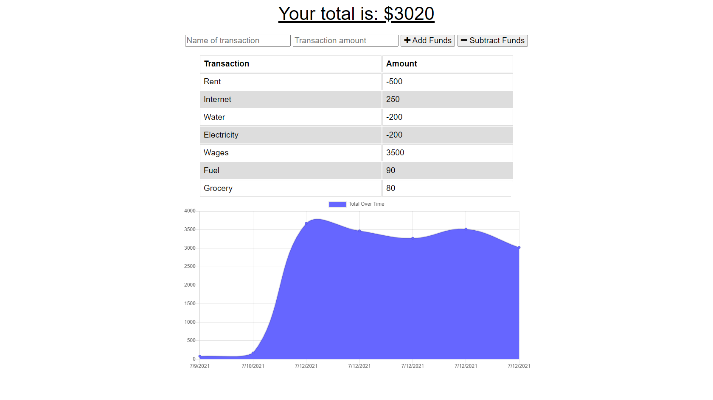

# PWA : Online/Offline Budget Tracker

### Table of Contents

- [Description](#description)
- [Installation](#installation)
- [Usage](#usage)
- [Contribution](#contribution)
- [License](#license)

## Description

The functionality of this budget tracker is to allow for offline access and functionality. The user will be able to add expenses and deposits to their budget with or without a connection. When entering transactions offline, they should populate the total when brought back online.

Offline Functionality:

- Enter deposits offline
- Enter expenses offline

When brought back online:

Offline entries will be added to tracker.

## Mock up

- The following image shows the tracker's functionality

## Home Page

## Installation

- Clone repository.
- `npm install`
- `node server.js`

## Usage

A demo of the application is available [here](https://calm-eyrie-65951.herokuapp.com/)

## Contribution

Please feel free in making contribution to this repository. But please first discuss the change via email with me. I will try to get back to you as soon as possible.

## Questions

If you have any questions feel free to contact me:

Github Username: sona29

Email: sona.shrestha004@gmail.com

## License

